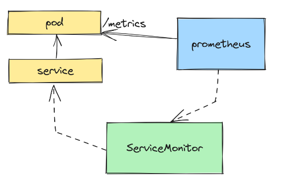
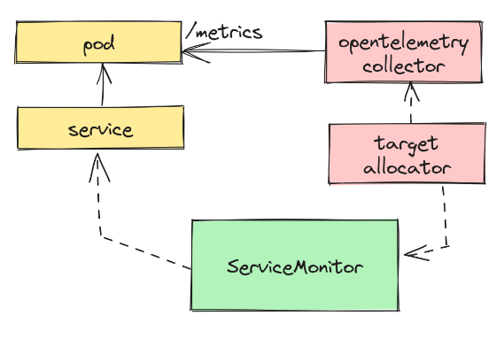

# Demo: OpenTelemetry

## Summary

OpenTelemetry is an Observability framework and toolkit designed to create and manage telemetry data such as traces, metrics, and logs. Crucially, OpenTelemetry is vendor- and tool-agnostic, meaning that it can be used with a broad variety of Observability backends, including open source tools like Jaeger and Prometheus, as well as commercial offerings. OpenTelemetry is a Cloud Native Computing Foundation (CNCF) project. [More Info](https://opentelemetry.io/) and [OpenTelemetry Registry](https://opentelemetry.io/ecosystem/registry/)

## OpenTelemetry Operator for Kubernetes

An implementation of a Kubernetes Operator, that manages collectors and auto-instrumentation of the workload using OpenTelemetry instrumentation libraries.

To install the operator in an existing cluster, make sure you have cert-manager installed and run:
```bash
kubectl apply -f https://github.com/open-telemetry/opentelemetry-operator/releases/latest/download/opentelemetry-operator.yaml
```

## Ingest Prometheus Metrics with OpenTelemetry

OpenTelemetry has become the gold standard of cloud-native observability. It is the platform that handles the three observability signals: Traces, metrics, and logs. Metrics are an especially interesting one, though. Metrics, and their consumption, are certainly not new to the world of observability. Prometheus has been around for quite some time now, and its adoption is nothing short of widespread.

OpenTelemetry knows this and embraces Prometheus metrics. While you are free to [implement metrics the OpenTelemetry way](https://opentelemetry.io/docs/specs/otel/metrics/), that definitely doesn’t mean you should give up on the Prometheus way. In fact, it’s unlikely that you have the bandwidth to rewrite all of your metric implementations in your software (who has time for that?).

Setting aside OpenTelemetry for a moment and focusing on a common Prometheus implementation, a really big helper in the Kubernetes metrics world is the Prometheus operator, which allows you to define[ Prometheus Custom Resources](https://github.com/prometheus-operator/prometheus-operator#customresourcedefinitions) and dramatically simplify Prometheus scrape config. Here’s a small example of what this could look like with a `ServiceMonitor`:

[](img/otel-prom1.png)

But let’s say you want to start using OpenTelemetry instead to ingest your metrics? OpenTelemetry doesn’t ask you to throw away this approach, thankfully.

**You can continue to expose Prometheus metrics from your applications and exporters! **🎉 The way that OpenTelemetry handles ingestion is through a very important component called the [OpenTelemetry Collector](https://opentelemetry.io/docs/collector/). The collector can receive Prometheus metrics by specifying a similar config. But what if you wanted to use the Prometheus operator’s custom resources, like ServiceMonitor and PodMonitor, to configure scraping? After all, this makes Prometheus metrics in a Kubernetes cluster much easier.

OpenTelemetry provides a component with the collector called the [Target Allocator](https://github.com/open-telemetry/opentelemetry-operator/tree/main/cmd/otel-allocator), which can take `ServiceMonitor` and `PodMonitor` CRs and supplement the collector’s Prometheus ingestion. Here’s how this looks now:

[](img/otel-prom2.png)

Instead of using Prometheus, we’re now using the OpenTelemetry collector to scrape our metrics. The target allocator knows how to read and handle Prometheus operator CRs, and supplements the Prometheus receiver’s configuration to get the metrics.

## TLDR solution

Let’s say you had a Python application that exposes a Prometheus counter metric `some_counter`:
```python
import random
import time
from prometheus_client import start_http_server, Counter

some_counter = Counter(name="some_counter", documentation="Sample counter")

def main() -> None:
    while True:
        random_sleep_time = random.randint(1, 20)
        print(f"Sleeping for {random_sleep_time} seconds", flush=True)
        time.sleep(random_sleep_time)
        some_counter.inc()

if __name__ == "__main__":
    start_http_server(port=8080)
    main()
```
Remember, this applications knows nothing about OpenTelemetry. To consume this metric with OpenTelemetry, we’ll define our collector using the very helpful [OpenTelemetry operator](https://github.com/open-telemetry/opentelemetry-operator):
```yml
apiVersion: opentelemetry.io/v1alpha1
kind: OpenTelemetryCollector
metadata:
  name: otelcol
spec:
  mode: statefulset
  targetAllocator:
    image: ghcr.io/open-telemetry/opentelemetry-operator/target-allocator:main
    enabled: true
    serviceAccount: otelcol
    prometheusCR:
      enabled: true
      serviceMonitorSelector:
        app: my-app
  config: |
    receivers:
      prometheus:
        config:
          scrape_configs:
          - job_name: 'otel-collector'
            scrape_interval: 30s
            static_configs:
            - targets: [ '0.0.0.0:8888' ]
        target_allocator:
          endpoint: http://otelcol-targetallocator
          interval: 30s
          collector_id: "${POD_NAME}"

    exporters:
      logging:
        verbosity: detailed

    service:
      pipelines:
        metrics:
          receivers: [prometheus]
          processors: []
          exporters: [logging]
```
There is a lot going on here, so let’s step through it. We’re creating an instance of the collector that has the target allocator enabled:
```yml
  targetAllocator:
    image: ghcr.io/open-telemetry/opentelemetry-operator/target-allocator:main
    enabled: true
    serviceAccount: otelcol
    prometheusCR:
      enabled: true
      serviceMonitorSelector:
        app: my-app
```

This sets the following for the target allocator, which is a separate deployment from the collector itself:

- The **image**, which I needed to use off of main due to a bug that isn’t in the latest release yet (likely you can ignore this and just use the default image, but it is helpful to know that you can override this if needed)
- The **serviceAccount** that this target allocator will run under, because it will require additional permissions (see below for the detailed RBAC settings for this service account)
- **prometheusCR** configuration, which enables and sets a serviceMonitorSelector so that the target allocator knows which ServiceMonitor resources to watch

Then the collector itself has the prometheus receiver configured:
```yml
      prometheus:
        config:
          scrape_configs:
          - job_name: 'otel-collector'
            scrape_interval: 30s
            static_configs:
            - targets: [ '0.0.0.0:8888' ]
        target_allocator:
          endpoint: http://otelcol-targetallocator
          interval: 30s
          collector_id: "${POD_NAME}"
```
This tells the collector to scrape itself (which exposes metrics as well), and the target allocator should be used to supplement scrape config. Then we set a single exporter:
```yml
    exporters:
      logging:
        verbosity: detailed
```
This is not what you would do in production, but this is an easy way to see the ingested metrics by just dumping them in the collector’s stdout. Finally, we have to tell the collector to use the `prometheus` receiver and the `logging` exporter for metrics:
```yml
    service:
      pipelines:
        metrics:
          receivers: [prometheus]
          processors: []
          exporters: [logging]
```

With this collector setup we can see both the collector and target allocator running in our cluster now:
```bash
$ kubectl get po | grep otel
otelcol-collector-0                                      1/1     Running   2 (37m ago)   37m
otelcol-targetallocator-8446ff7f55-9tgxv                 1/1     Running   0             37m
```

And creating the ServiceMonitor to point at our application’s service:
```yml
apiVersion: monitoring.coreos.com/v1
kind: ServiceMonitor
metadata:
  name: my-app
  labels:
    app: my-app
    release: prometheus
spec:
  selector:
    matchLabels:
      app: my-app
  endpoints:
    - port: prom
      path: /metrics
```

With this in place, our collector should now be scraping our application metrics! Let’s look in the collector’s logs:
```bash
$ kubectl logs otelcol-collector-0
...
Metric #7
Descriptor:
     -> Name: some_counter_total
     -> Description: Sample counter
     -> Unit: 
     -> DataType: Sum
     -> IsMonotonic: true
     -> AggregationTemporality: Cumulative
NumberDataPoints #0
Data point attributes:
     -> container: Str(my-app)
     -> endpoint: Str(prom)
     -> namespace: Str(default)
     -> pod: Str(my-app-6b557d48f6-xm4dk)
     -> service: Str(my-app)
StartTimestamp: 2023-07-02 14:20:47.005 +0000 UTC
Timestamp: 2023-07-02 14:58:47.005 +0000 UTC
Value: 226.000000
...
```

## Detailed solution

Here’s a fully-detailed setup of this using a local `kind cluster`.

## Create the kind cluster

Create the cluster with a [local registry](https://kind.sigs.k8s.io/docs/user/local-registry/).

## Install dependencies

```bash
$ helm install prometheus prometheus-community/kube-prometheus-stack
$ kubectl apply -f https://github.com/cert-manager/cert-manager/releases/download/v1.12.0/cert-manager.yaml
$ kubectl apply -f https://github.com/open-telemetry/opentelemetry-operator/releases/latest/download/opentelemetry-operator.yaml
```

## Sample application

Let’s now create our demo application to expose a Prometheus metric. First we’ll create and activate the virtual environment:
```bash
$ python3 -m venv venv
$ . venv/bin/activate
$ pip install prometheus-client
$ pip freeze > requirements.txt
```

Then create the application in app.py:
```python
import random
import time
from prometheus_client import start_http_server, Counter

some_counter = Counter(name="some_counter", documentation="Sample counter")

def main() -> None:
    while True:
        random_sleep_time = random.randint(1, 20)
        print(f"Sleeping for {random_sleep_time} seconds", flush=True)
        time.sleep(random_sleep_time)
        some_counter.inc()

if __name__ == "__main__":
    start_http_server(port=8080)
    main()
```
Now we need to create the Dockerfile so we can containizer this:
```bash
FROM python:3.10-slim

EXPOSE 8080

WORKDIR /app
COPY ./requirements.txt ./app.py .
RUN pip3 install -r ./requirements.txt

CMD ["python", "app.py"]
```
Finally let’s build and push this image to the local registry:
```bash
$ docker build -t localhost:5001/otel-prom:latest .
$ docker push localhost:5001/otel-prom:latest
```

Now we need to deploy the application to the cluster:
```yml
apiVersion: v1
kind: ServiceAccount
metadata:
  name: otelcol
---
apiVersion: rbac.authorization.k8s.io/v1
kind: ClusterRole
metadata:
  name: opentelemetry-targetallocator-cr-role
rules:
- apiGroups:
  - monitoring.coreos.com
  resources:
  - servicemonitors
  - podmonitors
  verbs:
  - '*'
---
apiVersion: rbac.authorization.k8s.io/v1
kind: ClusterRoleBinding
metadata:
  name: otelcol-prom
subjects:
  - kind: ServiceAccount
    name: otelcol
    namespace: default
roleRef:
  kind: ClusterRole
  name: opentelemetry-targetallocator-cr-role
  apiGroup: rbac.authorization.k8s.io
---
apiVersion: rbac.authorization.k8s.io/v1
kind: ClusterRole
metadata:
  name: opentelemetry-targetallocator-role
rules:
- apiGroups: [""]
  resources:
  - nodes
  - nodes/metrics
  - services
  - endpoints
  - pods
  verbs: ["get", "list", "watch"]
- apiGroups: [""]
  resources:
  - configmaps
  verbs: ["get"]
- apiGroups:
  - discovery.k8s.io
  resources:
  - endpointslices
  verbs: ["get", "list", "watch"]
- apiGroups:
  - networking.k8s.io
  resources:
  - ingresses
  verbs: ["get", "list", "watch"]
- nonResourceURLs: ["/metrics"]
  verbs: ["get"]
---
apiVersion: rbac.authorization.k8s.io/v1
kind: ClusterRoleBinding
metadata:
  name: otelcol-discovery
subjects:
  - kind: ServiceAccount
    name: otelcol
    namespace: default
roleRef:
  kind: ClusterRole
  name: opentelemetry-targetallocator-role
  apiGroup: rbac.authorization.k8s.io
```
And now we can deploy our collector and target allocator:
```yml
apiVersion: opentelemetry.io/v1alpha1
kind: OpenTelemetryCollector
metadata:
  name: otelcol
spec:
  mode: statefulset
  targetAllocator:
    image: ghcr.io/open-telemetry/opentelemetry-operator/target-allocator:main
    enabled: true
    serviceAccount: otelcol
    prometheusCR:
      enabled: true
      serviceMonitorSelector:
        app: my-app
  config: |
    receivers:
      prometheus:
        config:
          scrape_configs:
          - job_name: 'otel-collector'
            scrape_interval: 30s
            static_configs:
            - targets: [ '0.0.0.0:8888' ]
        target_allocator:
          endpoint: http://otelcol-targetallocator
          interval: 30s
          collector_id: "${POD_NAME}"

    exporters:
      logging:
        verbosity: detailed

    service:
      pipelines:
        metrics:
          receivers: [prometheus]
          processors: []
          exporters: [logging]
```

## ServiceMonitor

Finally we need to create the ServiceMonitor to point our target allocator to it:
```
apiVersion: monitoring.coreos.com/v1
kind: ServiceMonitor
metadata:
  name: my-app
  labels:
    app: my-app
    release: prometheus
spec:
  selector:
    matchLabels:
      app: my-app
  endpoints:
    - port: prom
      path: /metrics
```

## Viewing metrics

With this all setup, you should now be able to view metrics in the logs of your collector! Here’s a good one-liner to see all the metrics that have been collected:
```bash
$ kubectl logs otelcol-collector-0 | grep "Name:" | sort | uniq | xsel -b
     -> Name: otelcol_exporter_enqueue_failed_log_records
     -> Name: otelcol_exporter_enqueue_failed_metric_points
     -> Name: otelcol_exporter_enqueue_failed_spans
     -> Name: otelcol_exporter_sent_metric_points
     -> Name: otelcol_process_cpu_seconds
     -> Name: otelcol_process_memory_rss
     -> Name: otelcol_process_runtime_heap_alloc_bytes
     -> Name: otelcol_process_runtime_total_alloc_bytes
     -> Name: otelcol_process_runtime_total_sys_memory_bytes
     -> Name: otelcol_process_uptime
     -> Name: otelcol_receiver_accepted_metric_points
     -> Name: otelcol_receiver_refused_metric_points
     -> Name: process_cpu_seconds_total
     -> Name: process_max_fds
     -> Name: process_open_fds
     -> Name: process_resident_memory_bytes
     -> Name: process_start_time_seconds
     -> Name: process_virtual_memory_bytes
     -> Name: python_gc_collections_total
     -> Name: python_gc_objects_collected_total
     -> Name: python_gc_objects_uncollectable_total
     -> Name: python_info
     -> Name: scrape_duration_seconds
     -> Name: scrape_samples_post_metric_relabeling
     -> Name: scrape_samples_scraped
     -> Name: scrape_series_added
     -> Name: some_counter_created
     -> Name: some_counter_total
     -> Name: up
```

As you can see, our `some_counter` is now being collected by OpenTelemetry!

## Links

- [Ingest Prometheus Metrics with OpenTelemetry](https://trstringer.com/opentelemetry-prometheus-metrics/)
- [opentelemetry-operator](https://github.com/open-telemetry/opentelemetry-operator)


