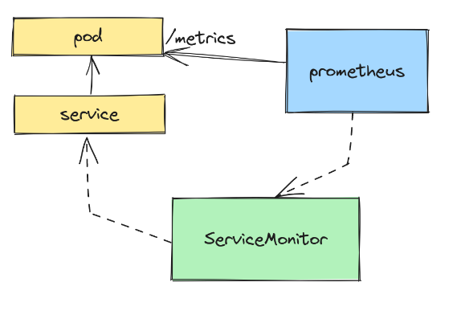

# Ingest Prometheus Metrics with OpenTelemetry

OpenTelemetry has become the gold standard of cloud-native observability. It is the platform that handles the three observability signals: Traces, metrics, and logs. Metrics are an especially interesting one, though. Metrics, and their consumption, are certainly not new to the world of observability. Prometheus has been around for quite some time now, and its adoption is nothing short of widespread.

OpenTelemetry knows this and embraces Prometheus metrics. While you are free to [implement metrics the OpenTelemetry](https://opentelemetry.io/docs/specs/otel/metrics/) way, that definitely doesn’t mean you should give up on the Prometheus way. In fact, it’s unlikely that you have the bandwidth to rewrite all of your metric implementations in your software (who has time for that?).

Setting aside OpenTelemetry for a moment and focusing on a common Prometheus implementation, a really big helper in the Kubernetes metrics world is the Prometheus operator, which allows you to define [Prometheus Custom Resources](https://github.com/prometheus-operator/prometheus-operator#customresourcedefinitions) and dramatically simplify Prometheus scrape config. Here’s a small example of what this could look like with a ServiceMonitor:

## Links

- [Original Post](https://trstringer.com/opentelemetry-prometheus-metrics/)